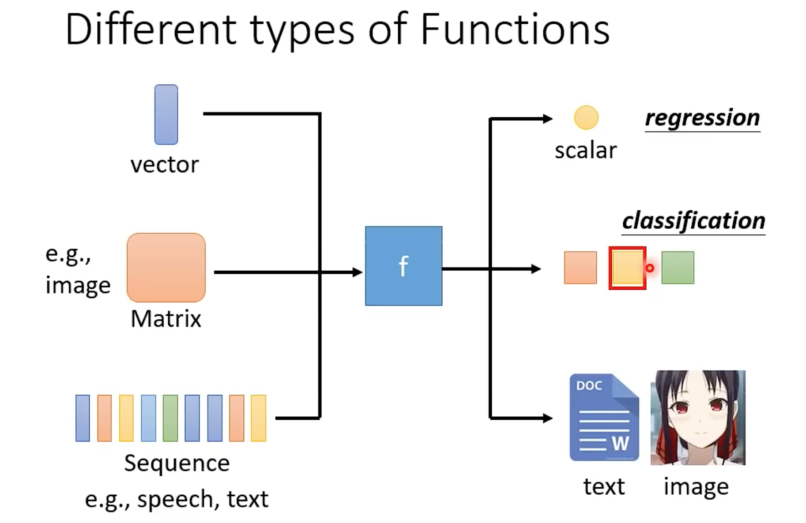
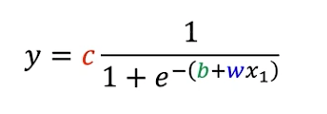
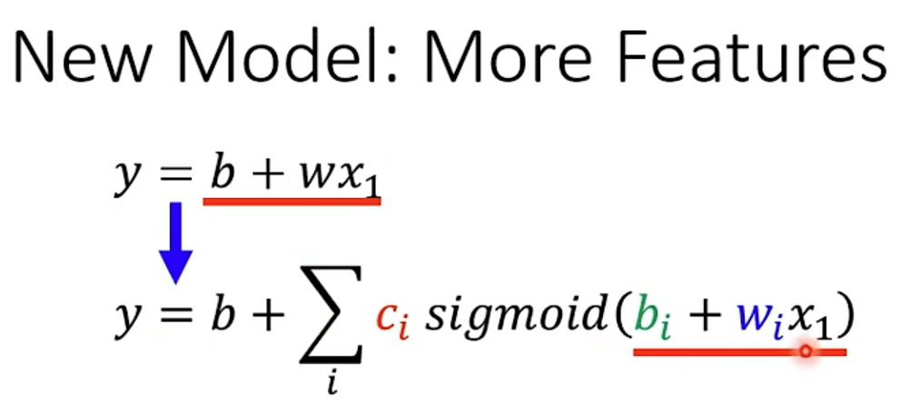

# ML

Machine Learning ≈ Looking for Function

深度学习，就是这个function是类神经网络的形式。

## Introduction

机器学习根据输出，其任务分为：

- Regression
- Classification
- Structured Learning

做机器学习的步骤：

1. Function with Unknown Parameters. 

   y = b + wx

2. Define Loss from Training Data

   将w和b作为损失函数的输入，e为损失e = | y - y^ |, L(w,b)=1/N*Σe，可以用MAE、MSE或其他作为损失函数

3. Optimization

   找到最佳的w\* 和 b\*，其过程是随机找一个点，计算微分，然后根据微分的值，逐步向minima值靠近，其中可以设置学习率，表示向minima点靠近的速度。以只有一个w为例，w1 = w0 - η* L'/w'，η是学习率，为超参数。

   

所有的samples（用N表示）可以分成很多batch（用B表示），每运行一个batch，就update一次，运行完全部batch之后，就是epoch一次。例如N=10000，B=100，则可以分为10000/100=100组，1epoch = 100update

Overfitting：在训练集变好，在测试集变差。

Linear Model存在bias，无法模拟实际情况，就用了Piecewise Linear（分段线性），实际是用Sigmoid Function，简写为 `y=c sigmoid(b+wx)`

- 改变w就是改变斜率
- 改变b就是左右移动
- 改变c是改变高度

